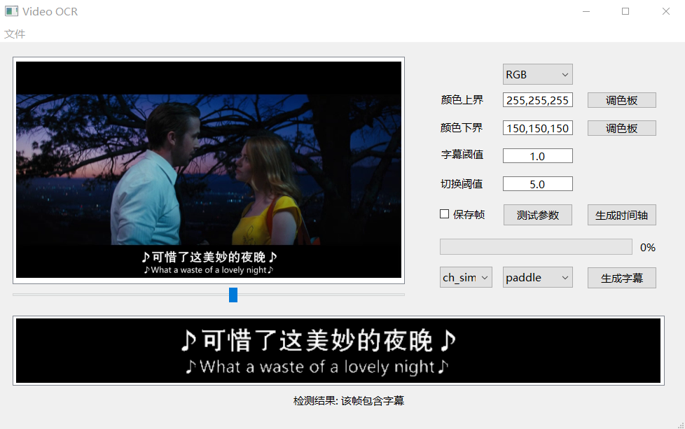
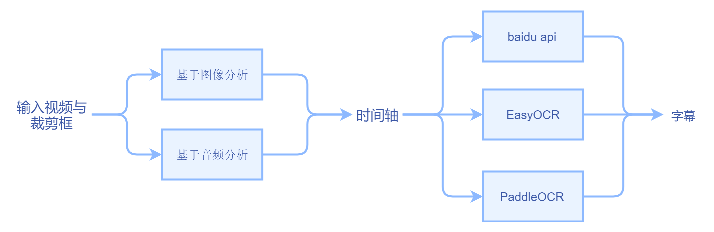

# VIDEO_OCR

基于 paddle_ocr/easy_ocr(本地) 和 百度AI平台(在线) 实现的视频硬嵌入字幕提取

## 用法

1. 到 `release`  中下载最新的 `video_ocr.tar.gz` 并解压
2. 运行 `python main_gui.bat` 
3. 左上角打开视频文件
4. 在视频预览窗口用鼠标画框，并滑动进度条检查框是否框住所有字幕
5. 打开颜色上界的调色板，选择或者使用 `Pick Screen Color` 确定字幕的颜色
6. 打开颜色下界的调色板，选择或者使用 `Pick Screen Color` 确定背景的颜色
7. 字幕阈值越小，越容易判定为字幕帧
8. 切换阈值越小，越容易判定为字幕帧结束或者切换
9. 点击 `测试参数` 可以测试参数是否合适，并在最下方会有结果显示
10. 在 `chi_sim` 下拉框选择字幕语言
11. 点击生成时间轴，字幕默认输出到 `frame/[video_name].split_vision.ass`，生成过程中可能图形界面会有卡顿，只要后台命令行在动就行，生成成功会弹出提示框
12. 带时间轴生成之后，在 `paddle` 下拉框选择 ocr 接口（精度 paddle > baidu api > easyocr，速度反之）
13. 点击生成字幕，字幕默认输出到原目录，生成过程中可能图形界面会有卡顿，只要后台命令行在动就行，生成成功会弹出提示框

## 代码逻辑

## 百度 API（非必须）

+ 百度 API 在以下界面申请使用: [通用文字识别能力](https://ai.baidu.com/tech/ocr/general)

+ 申请之后，在此目录下新建 `baidu_keys.txt` 文本文档，把 `app_id` 、 `client_id`、 `client_secret`  分成两行存入该文本文档即可。

+ 详见 [HTTP-SDK文档](https://cloud.baidu.com/doc/OCR/s/wkibizyjk)

  > 常量`APP_ID`在百度智能云控制台中创建，常量`API_KEY`与`SECRET_KEY`是在创建完毕应用后，系统分配给用户的，均为字符串，用于标识用户，为访问做签名验证，可在AI服务控制台中的**应用列表**中查看。
  >
  > **注意**：如您以前是百度智能云的老用户，其中`API_KEY`对应百度智能云的“Access Key ID”，`SECRET_KEY`对应百度智能云的“Access Key Secret”。

## TODO

- [x] ~~改变视频时间轴方式，改为生成时间轴，而不是保存图片，这样和音频可以共用ocr环节~~
- [x] ~~百度 API 更新~~
- [x] ~~双语字幕轴~~
- [ ] 自动转成各种OCR需要的缩写
- [ ] 通过音频生成时间轴
- [ ] GUI 界面
  - [x] ~~视频显示与拖动查看~~
  - [x] ~~各种选项与按钮的设计与监听~~
  - [x] ~~进度条与完成提示~~
  - [x] ~~非法动作的识别与处理~~
  - [x] ~~耗时算法的线程化~~
    - [ ] 并行多线程
  - [ ] 字幕颜色取色器
    - [x] ~~基本取色器~~
    - [ ] 取色器放大镜
  - [x] 字幕裁剪框的交互
- [ ] 其他计划
  - [ ] QSS 美化
  - [ ] 打包
