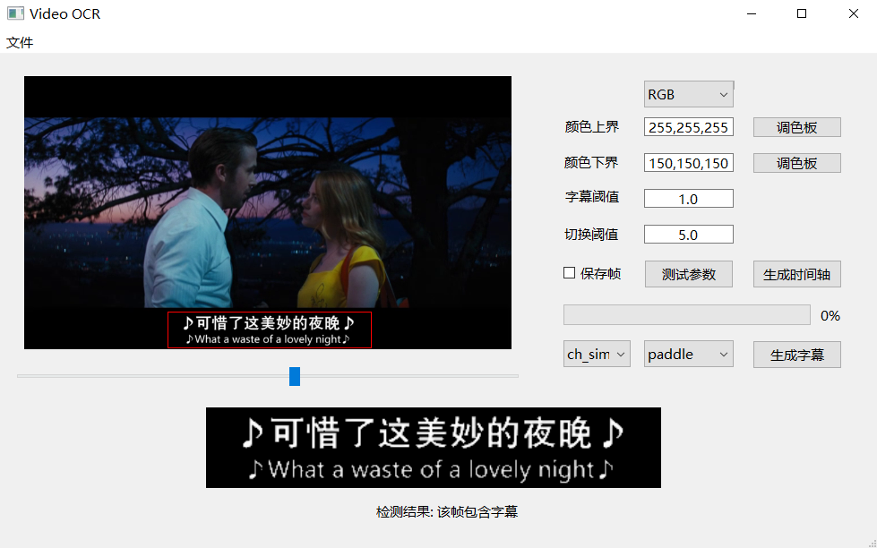

# VIDEO_OCR

基于 paddle_ocr/easy_ocr(本地) 和 百度AI平台(在线) 实现的视频硬嵌入字幕提取

## 依赖

+ python 依赖:  通过  `pip install -r requirements.txt` 命令安装

+ 百度 API：
  + 百度 API 在以下界面申请使用: [通用文字识别能力](https://ai.baidu.com/tech/ocr/general)
  
  + 申请之后，在此目录下新建 `baidu_keys.txt` 文本文档，把 `app_id` 、 `client_id`、 `client_secret`  分成两行存入该文本文档即可。
  
  + 详见 [HTTP-SDK文档](https://cloud.baidu.com/doc/OCR/s/wkibizyjk)
  
    > 常量`APP_ID`在百度智能云控制台中创建，常量`API_KEY`与`SECRET_KEY`是在创建完毕应用后，系统分配给用户的，均为字符串，用于标识用户，为访问做签名验证，可在AI服务控制台中的**应用列表**中查看。
    >
    > **注意**：如您以前是百度智能云的老用户，其中`API_KEY`对应百度智能云的“Access Key ID”，`SECRET_KEY`对应百度智能云的“Access Key Secret”。

## 用法

1. 运行 `python main_gui.py`

## TODO

- [x] ~~改变视频时间轴方式，改为生成时间轴，而不是保存图片，这样和音频可以共用ocr环节~~
- [x] ~~百度 API 更新~~
- [x] ~~双语字幕轴~~
- [ ] 自动转成各种OCR需要的缩写
- [ ] 通过音频生成时间轴
- [ ] GUI 界面
  - [x] ~~视频显示与拖动查看~~
  - [x] ~~各种选项与按钮的设计与监听~~
  - [x] ~~进度条与完成提示~~
  - [x] ~~非法动作的识别与处理~~
  - [x] ~~耗时算法的线程化~~
  - [ ] 字幕颜色取色器
  - [ ] 字幕裁剪框的交互
- [ ] 其他计划
  - [ ] QSS 美化
  - [ ] 打包
